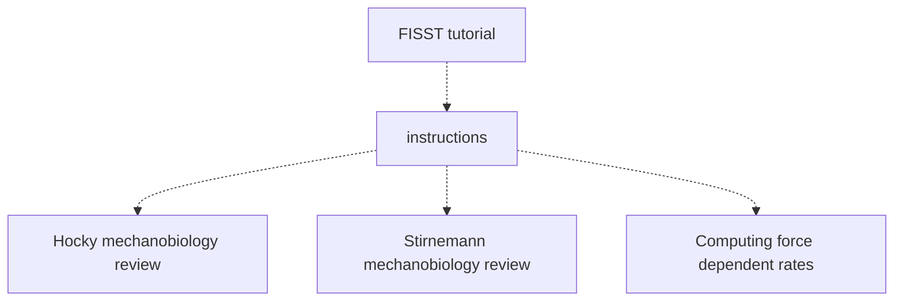

# Tutorial - Advanced mechanical pulling

This goes beyond what was presented in PLUMED Masterclass 22.15, and which is now available as a Tutorial on [this page](https://www.plumed-tutorials.org/lessons/22/015/data/NAVIGATION.html)

This tutorial provides theoretical background then gives a set of exercises for you to complete. You may want to watch the videos that accompany the previous tutorial first.

The flow chart shown below indicates the order in which you should consult the resources.  You can click on the nodes to access the various resources.  Follow the thick black lines for the best results.  The resources that are connected by dashed lines are supplmentary resources that you may find useful when completing the exercise.

Some relevant perspective articles to consider are [this one](https://doi.org/10.1021/acs.jpcb.1c06330) from Hocky and [this one](https://doi.org/10.1021/acs.jpcb.1c10715) from Stirnemann.

Solutions are available from [This page](https://github.com/hockyg/plumed-tutorial-force2)

